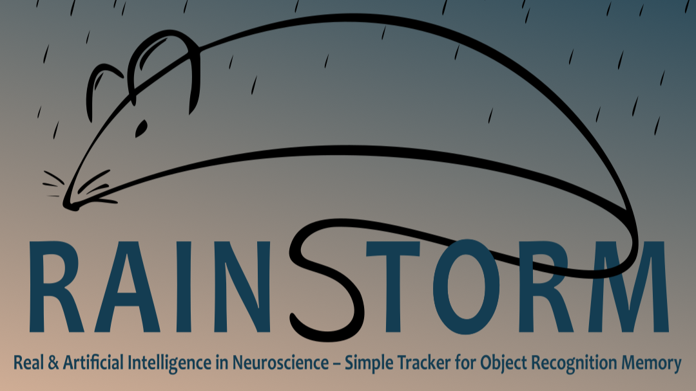
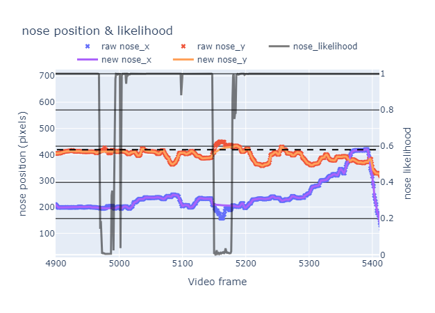
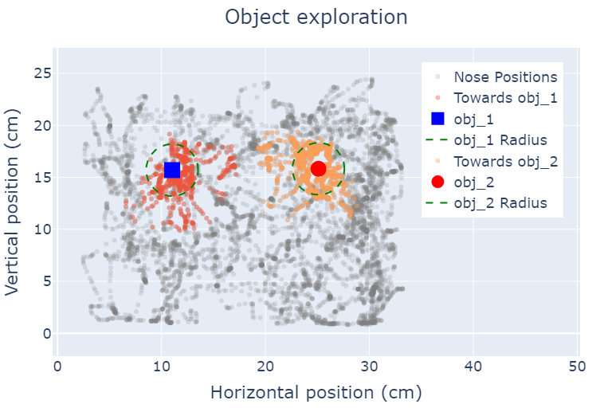
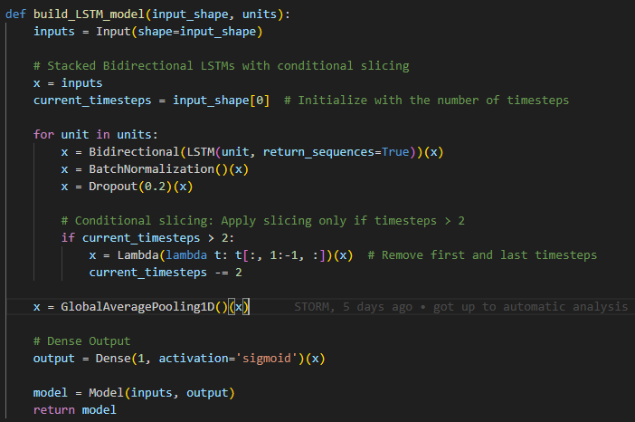
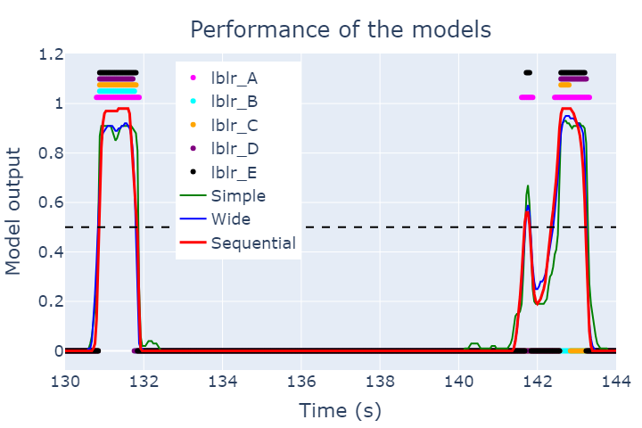
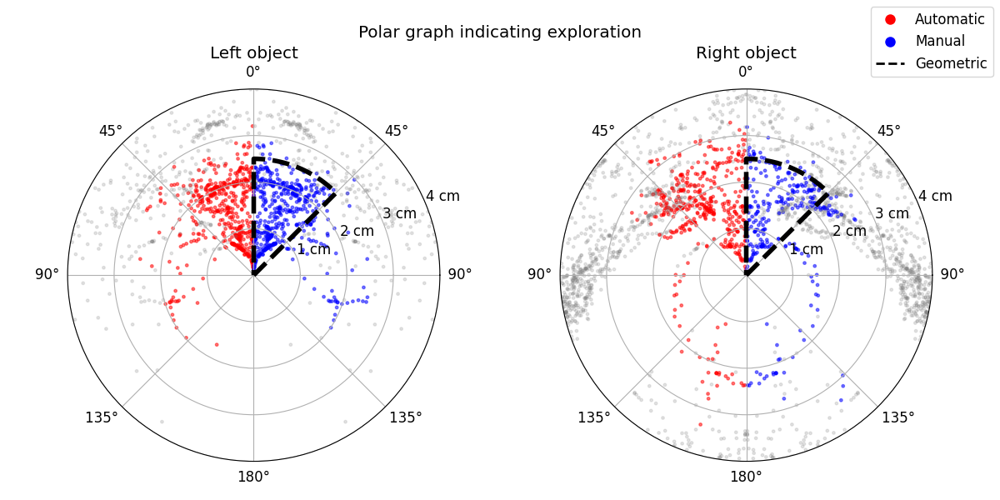
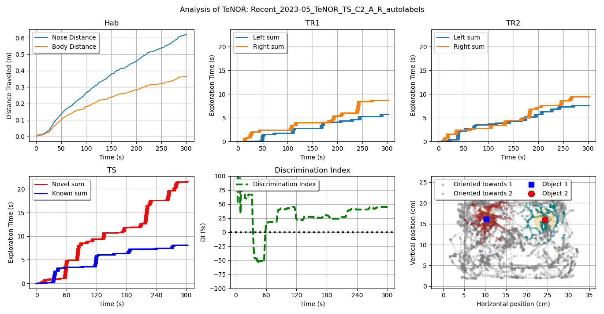
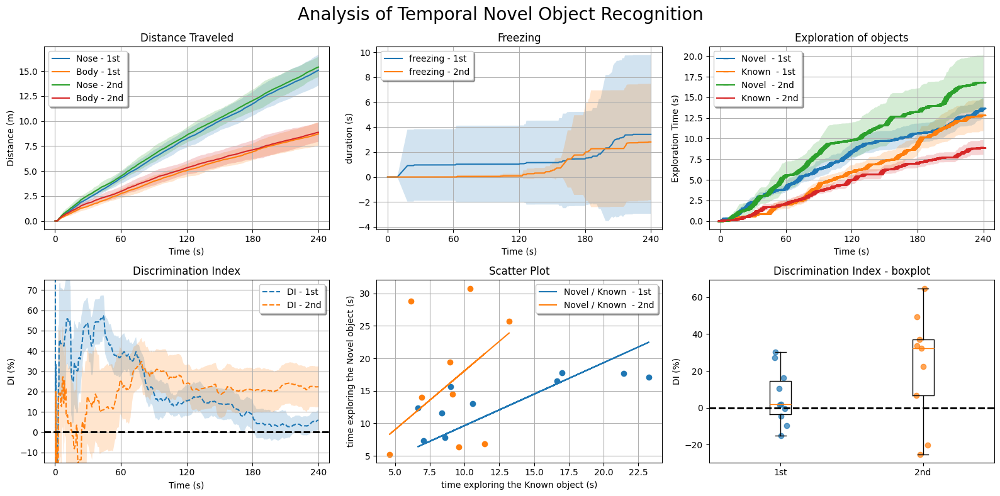
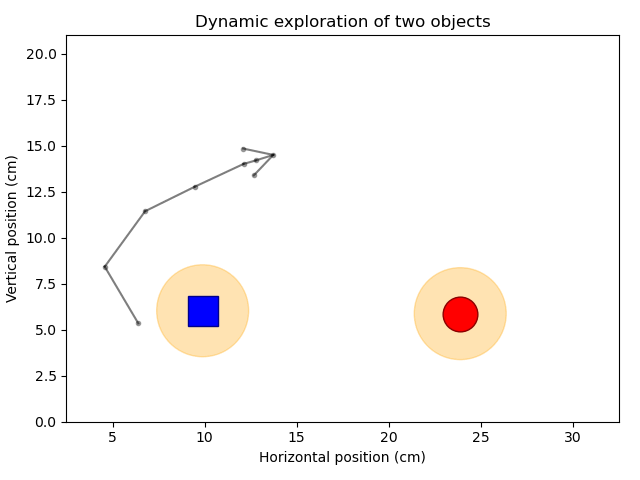

<div align="center">
  
# **RAINSTORM**
### Real & Artificial Intelligence Networks – Simple Tracker for Object Recognition Memory



</div>

**RAINSTORM** is a tool for scoring object recognition memory in mice 🐭. It allows users to automate the analysis of recognition memory performance through training of artificial neural networks. DeepLabCut analyzes video files and returns the position of the mouse's bodyparts... What we do next is up to us!

---
---

## **Features**  

- **Frame-by-Frame Behavioral Labeling**  
   Use this versatile tool for accurate manual scoring. On top of that, prepare your data to train an artificial neural network to recognize behaviors.  

- **Post-DeepLabCut Data Processing**  
   Clean up tracking glitches like disappearing body parts and ensure smooth, reliable data. 

- **Geometric Analysis for Exploration**  
   Leverage distance and angle metrics to identify exploration behavior with precision.  

- **Immobility Detection for Freezing Analysis**  
   Automatically label freezing behavior based on motion, a key indicator of memory performance.  

- **AI-Powered Automatic Labeling**  
   Train and utilize artificial neural networks to detect temporal sequences of exploration behavior.  

- **Visual Label Comparison**  
   Easily compare manual, geometric, and AI-generated labels using intuitive visualizations.

---
---

## **Installation**
  Follow these steps to install RAINSTORM and launch your first notebook:

1. **Install Miniconda (or Anaconda)**
  Download and install Miniconda or Anaconda from the [official installation site](https://docs.anaconda.com/miniconda/install/).

2. **Install Visual Studio Code**
  Download and install Visual Studio Code from the [official installation site](https://code.visualstudio.com/Download)
  During installation, ensure you add VS Code to your PATH (check the box if prompted).

3. **Clone the RAINSTORM Repository**
  Open a terminal (e.g. Miniconda Prompt).
  Navigate to your Desktop:
  ```bash
  cd ~/Desktop
  ```
  
  Clone the repository:
  ```bash
  git clone https://github.com/your-username/rainstorm.git
  ```
  This will create a folder named RAINSTORM on your Desktop.

4. **Set Up the Conda Environment**
  Navigate to the rainstorm directory:
  ```bash
  cd rainstorm
  ```
  Create the Conda environment:
  ```bash
  conda env create -f rainstorm_venv.yml
  ```
  Activate the environment:
  ```bash
  conda activate rainstorm
  ```
5. **Open VS Code**
  Launch VS Code from the terminal:
  ```bash
  code .
  ```
  In VS Code, ensure the Python extension is installed:
  - Go to the Extensions view (```Ctrl+Shift+X``` or ```Cmd+Shift+X``` on macOS).
  - Search for "Python" and install the extension provided by Microsoft.
  Open the ```0-First_steps.ipynb``` notebook.
  - When prompted to select a kernel, choose the ```rainstorm``` Conda environment among the ```Python Environments```.

6. **Start Exploring RAINSTORM**
  - Run the cells in 0-First_steps.ipynb to get started.
  - From now on, you can launch any of the notebooks from the RAINSTORM repository just by clicking on them in VS Code.
The setup is complete!

---
---

## **Pipeline**
The repository contains a series of Jupyter notebooks to go from raw pose estimation data to the visualization of your results:

```0-First_steps.ipynb```: Learn the basics and set up your data.

---

```1-Prepare_positions.ipynb```: Process and clean bodypart position data.
- Filter out the frames where the mouse is not in the video.
- Points that have a low likelihood assigned by DLC are also filtered out, and data is interpolated and smoothed.
- Conveniently scale the video from pixels to cm.
- Return: We obtain .csv files with the correct, scaled positions of the mice.



---

```2-Geometric_analysis.ipynb```: Perform geometric labeling of exploration and freezing.

- One way of finding out when the mouse is exploring an object is to use a geometric criteria:
  - If the mouse is close to the object (distance < 2.5 cm).
  - If the mouse is oriented towards the object (angle < 45°).



---

```3-Create_Models.ipynb```: Train AI models for automatic behavioral labeling.

- Another way of finding out when the mouse is exploring is to train an artificial neural network with manually labeled data:



- Using TensorFlow, we were able to train models that are able to clasify a mouse's position into exploration.
- Among the models, we train a more complex LSTM network that is aware of frame sequences, and performs better as exploration is time dependant.
- The training learns from our own manual labeling, so it acquires the criteria of the users.

---

```4-Evaluate_Models.ipynb```: Assess and improve your trained models.



---

```5-Automatic_analysis.ipynb```: Automate labeling with your AI model.


---

```6-Compare_Labels.ipynb```: Compare manual, geometric, and AI-generated labels.

- Once we have the manual, geometric and automatic labels, we can compare the performance of each on an example video
- Using a polar graph, we can see for each position the angle of approach and distance in which the mice is exploring the objects



---

```7-Seize_Labels.ipynb```: Extract and summarize your labeled data.

- We can use the best labels to evauate the memory performance of a single mouse:



- And finally, we can find differences in the exploration of objects for a group of trained mice (which was the obective all along):



---
---

## **Conclusions**
- This project, although already in use, is a work in progress that could significantly improve the way we analyze object exploration videos.
- If you wish to contact us, please do so: simple.torm@gmail.com
- © 2024. This project is openly licensed under the MIT License.

#### Thanks for exploring us!


