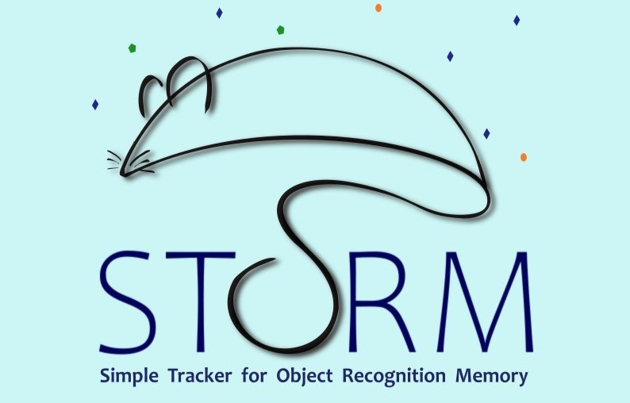
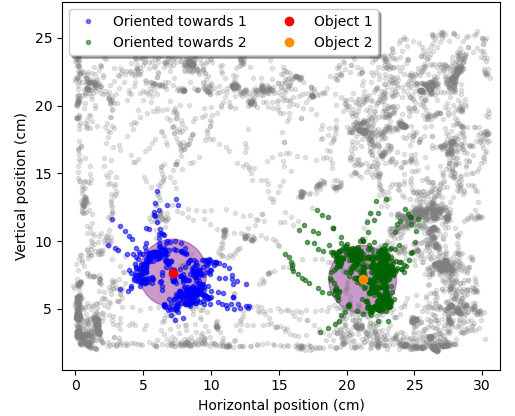
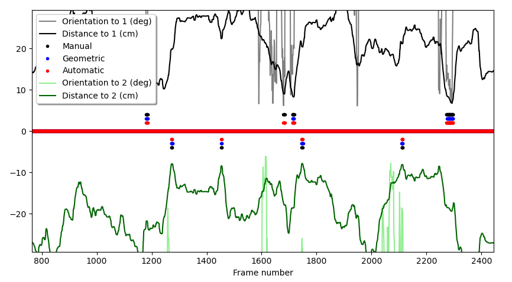
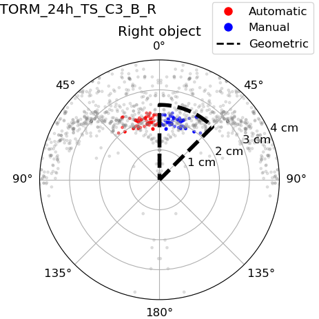
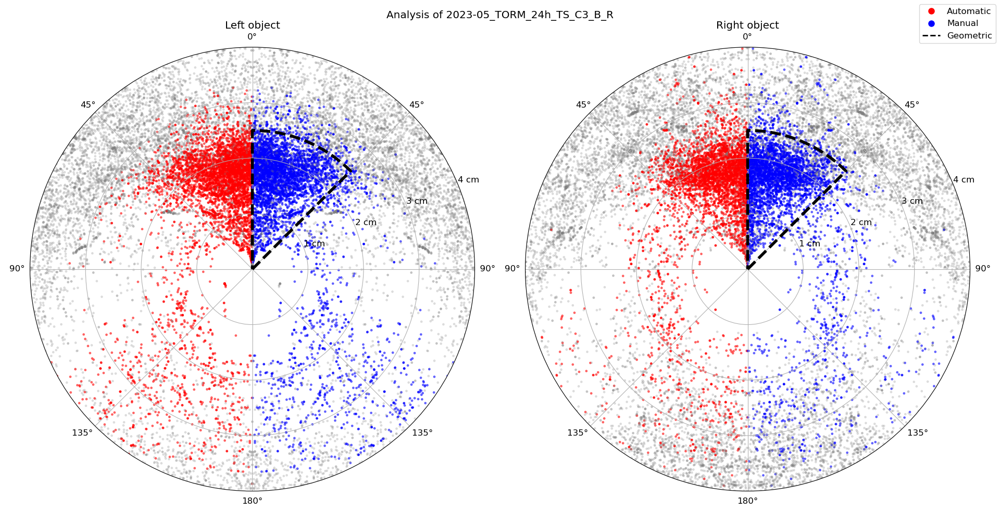
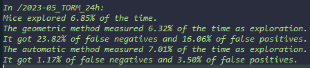
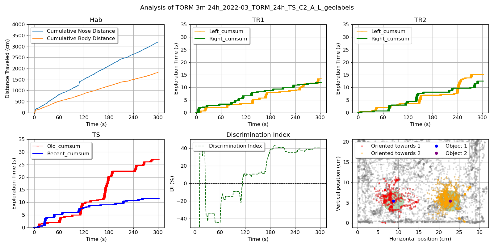
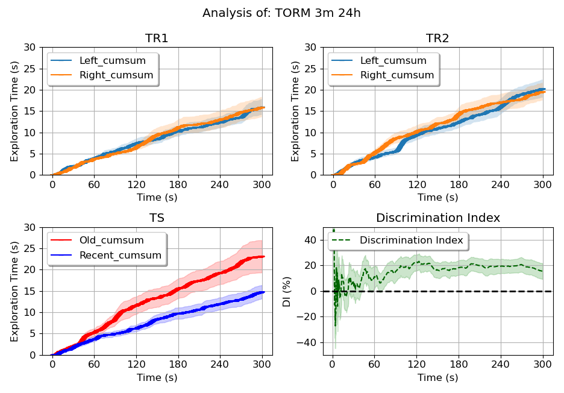

# STORM - Simple Tracker for Object Recognition Memory

STORM is a tool for tracking object recognition memory. It allows users to track and analyze memory performance through the exploration of objects.

### Features

- Data processing to avoid dissapearing bodyparts
- Geometric labeling through distance and angle of aproach
- Automatic labeling using a trained AI model able to detect of temporal sequences of behaviour
- Comparing labels in a visual and simple way

### Future steps

- Learn to apply further DeepLabCut analysis:
  - Multianimal tracking for social memories
  - Apply detection of moving objects for dinamic maze designs

# Pipeline

## Manage_H5

- DeepLabCut analyzes video files and returns a .H5 file with the position of the mouse's bodyparts (along with two objects, in the case of object exploration)
- It is important to filter from the file the frames where the mouse is not in the video
- Points that have a low likelihood assigned by DLC are filtered and data is processed by filters
- Also, it is convenient to scale the video from pixels to cm
- Return: We obtain .csv files with the scaled positions of the mice

## Geometric_Labeling

- One way of finding out when the mouse is exploring an object is to use a geometric criteria:
  - If the mouse is close to the object (distance < 2.5 cm)
  - If the mouse is oriented towards the object (angle < 45°)

## Automatic_Labeling

- Another way of finding out when the mouse is to train an artificial neural network with manually labeled data:
  - So far I am training a random forest model to classify each frame in exploration of either object
  - It trains based on my own manual labeling, so it acquires my criteria.

## Compare_Labels

- Once we have the manual, geometric and automatic labels, we can compare the labels using a polar graph, which shows the angle of approach and distance in which the mice is exploring the objects
- For a single video:

- Or for many videos together:

#### Since the automatic method learns to detect exploration unrestricted by the angle and distance to the object, it tends to be more accurate

## Seize_Labels

- We can use the desired labels to evauate the performance of a mouse during the different sessions:

- And finally, we can find differences in the exploration of objects for a group of trained mice (which was the obective all along):

# In conclusion
- This project, although already in use, is a work in progress that could someday improve the way we analyze object exploration videos.
- If you wish to contact us, please do so: simple.torm@gmail.com
