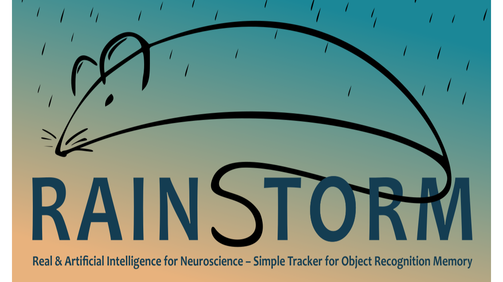
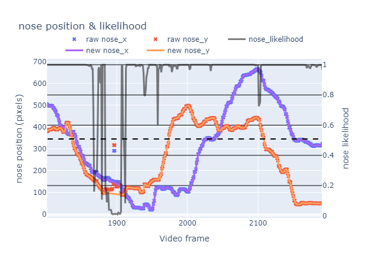
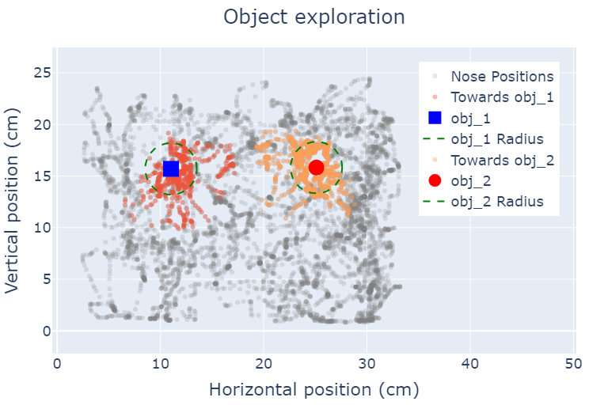
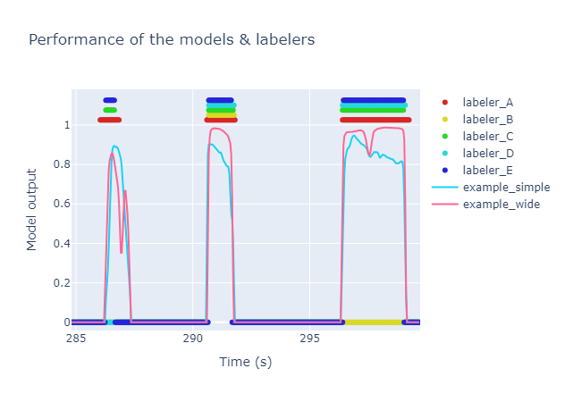
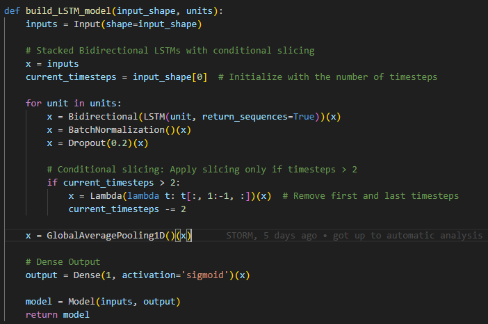
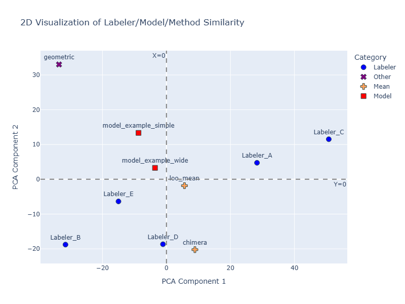
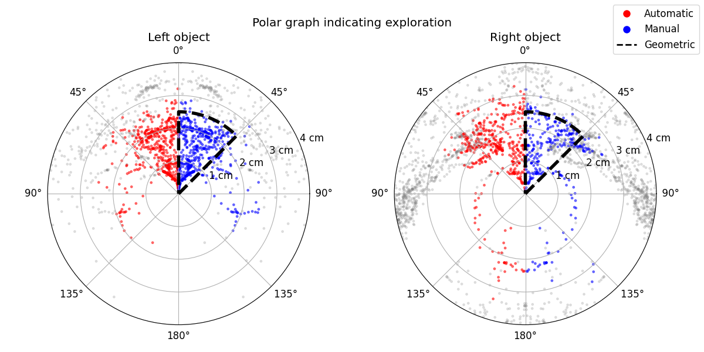
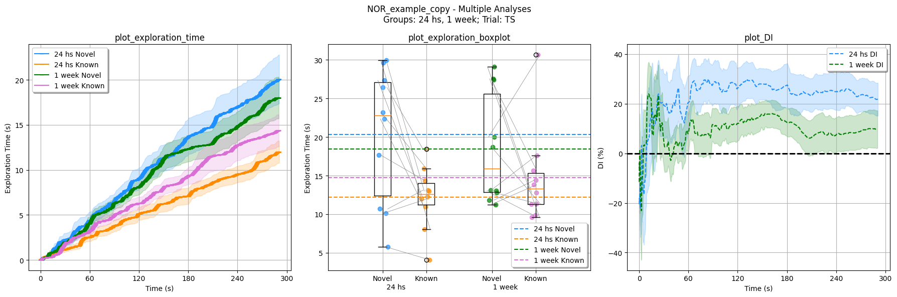

<div align="center">

# 🌧️ **RAINSTORM** 🌧️

### Real & Artificial Intelligence for Neuroscience – Simple Tracker for Object Recognition Memory

**A complete toolkit for analyzing rodent exploratory behavior in object recognition tasks.**



</div>

**RAINSTORM** is a comprehensive Python toolkit for analyzing rodent exploratory behavior 🐭. Transform pose-estimation data (e.g., from DeepLabCut or SLEAP) into meaningful behavioral insights through an intuitive workflow that spans from manual annotation to AI-powered automation.

---

## Table of Contents 📋

* [Features ✨](#features-)
* [Installation 💾](#installation-)
* [Usage 💻](#usage-)
    - [Video Handling 🎥](#video-handling-)
    - [RAINSTORM Behavioral Labeler ✍️](#rainstorm-behavioral-labeler-)
    - [The RAINSTORM Pipeline 🔬](#the-rainstorm-pipeline-)
* [Citation 📜](#citation-)
* [Contributing 🤝](#contributing-)
* [Contact 📫](#contact-)

---

## Features ✨

* **🎯 Frame-by-Frame Behavioral Labeling:** A versatile tool for precise manual annotation, it generates training data for your AI models.
* **🔧 Pre & Post-DLC Data Processing:** Align video points, clean tracking glitches, and interpolate data for smooth and reliable analysis.
* **📐 Geometric Analysis:** Automatically identify object exploration using distance and angle metrics.
* **🧊 Immobility Detection:** Label freezing behavior based on motion, a key indicator in memory studies.
* **⚙️ AI-Powered Automatic Labeling:** Train and deploy neural networks (including LSTMs) to automatically detect complex exploration patterns.
* **📊 Visual Label Comparison:** Easily compare manual, geometric, and AI-generated labels with intuitive visualizations.

---

## Installation 💾

### Prerequisites

First, ensure you have the following software installed on your system.

* [Miniconda](https://docs.conda.io/projects/miniconda/en/latest/miniconda-install.html) (or Anaconda)
* [Visual Studio Code](https://code.visualstudio.com/Download)
* [Git](https://git-scm.com/downloads)

> [!TIP]
> **First Time Setup**: During Miniconda installation, select **"Add Conda to PATH"** for easier terminal access. Restart your computer after installation to ensure all components are properly configured.

### Setup Steps

1.  **Clone the Repository**

    Open a terminal (or Miniconda Prompt) and run the following command.
    ```bash
    git clone https://github.com/sdhers/rainstorm.git
    ```
    This will create a `rainstorm` folder in your current directory.

2.  **Set Up the Conda Environment**

    Navigate into the cloned directory and create the dedicated environment from the provided file:
    ```bash
    cd rainstorm
    conda env create -f rainstorm_venv.yml
    ```
    Once the environment is ready, you can activate it by running `conda activate rainstorm`.

3.  **Launch VS Code & Select Kernel**

    Launch VS Code from the terminal:
    ```bash
    code .
    ```
    In VS Code, ensure the Python extension is installed:
    * Go to the Extensions view (`Ctrl+Shift+X` or `Cmd+Shift+X` on macOS).
    * Search for "Python" and install the official extension from Microsoft.

    Open a Jupyter notebook (e.g., `2a-Prepare_positions.ipynb`).
    * When prompted to select a kernel, choose the `rainstorm` Conda environment from the list of `Python Environments`.

You are all set! You can now run the notebooks to explore the RAINSTORM workflow.

---

## Usage 💻

RAINSTORM provides a comprehensive workflow through 7 interactive Jupyter notebooks, plus standalone GUI tools for video processing and behavioral labeling.

Transform your data from raw videos to publication-ready results through our intuitive 7-step workflow:

| Step   | Notebook                      | Purpose                    | Output                            |
| ------ | ----------------------------- | -------------------------- | --------------------------------- |
| **0**  | `0-Video_handling.ipynb`      | 🎥 Prepare videos          | Trimmed, cropped, aligned videos  |
| **1**  | `1-Behavioral_labeler.ipynb`  | ✍️ Manual annotation       | Frame-by-frame behavioral labels  |
| **2a** | `2a-Prepare_positions.ipynb`  | 🧹 Clean tracking data     | Filtered, smoothed position files |
| **2b** | `2b-Geometric_analysis.ipynb` | 📐 Geometric detection     | Rule-based behavioral labels      |
| **3a** | `3a-Create_models.ipynb`      | 🤖 Train AI models         | Custom neural networks            |
| **3b** | `3b-Automatic_analysis.ipynb` | 🧠 AI-powered labeling     | Automated behavioral detection    |
| **4**  | `4-Seize_labels.ipynb`        | 📊 Results & visualization | Personalized plots & analyses        |


---

### Video Handling 🎥

We offer a quick and easy way to prepare videos for pose estimation and behavioral analysis.

**Open the file `0-Video_handling.ipynb`**

1.  **Run the Video Handling app**
    This app allows you to:
    * Trim the video to the desired length.
    * Crop the video to the desired size.
    * Align videos based on two manually selected points (very useful when batch processing videos with ROIs).
2.  **Run the Draw ROIs app**
    This app allows you to:
    * Draw ROIs and points on the video.
    * Select a distance for scaling.

> [!TIP]
> **Running DLC on Colab**: Use our DeepLabCut pretrained model on Google Colab to process your aligned videos:
> 1. Copy this [Google Drive Folder](https://drive.google.com/drive/folders/1EwL5dtJNvogaXlIKm5NzLYlX--ZpAdxK?usp=sharing) in your own Google Drive.
> 2. Add your own data to the "videos" folder.
> 3. Open the Colab file and follow the instructions to run the model on your data.

---

### RAINSTORM Behavioral Labeler ✍️

For precise, frame-by-frame annotation, use the **RAINSTORM Behavioral Labeler**.

**Open and run the file `1-Behavioral_labeler.ipynb`**

1.  **Select the video you want to label.**

2.  **(Optional) Load a previous labeling `.csv` file.**
    * This allows you to pick up where you left off.

3.  **Select the behaviors to label and their keys.**
    * Enter the behaviors you want to score (e.g., `exp_1`, `exp_2`, `freezing`, `grooming`, etc...).

> [!WARNING]
> Keys should be unique, single characters, and different from the fixed control keys: (Quit: `q`, Zoom In: `+`, Zoom Out: `-`, Timeline toogle: `t`)

4.  **Start Labeling!**
    After pressing 'Start Labeling', the video will load, and you can begin annotating frame by frame using the keys you defined.

---

### The RAINSTORM Pipeline 🔬

#### `2a-Prepare_positions.ipynb`

🧹 **Process and clean bodypart position data.**

* Filters out frames with low tracking likelihood from DeepLabCut.
* Interpolates and smooths data to correct glitches.
* **Output:** Clean `.csv` files ready for analysis.



---

#### `2b-Geometric_analysis.ipynb`

📐 **Perform geometric labeling of exploration and freezing.**

* Applies a simple geometric rule for exploration:
    * Distance to object < `2.5 cm`
    * Angle towards object < `45°`
* Identifies freezing behavior based on lack of movement.



---

#### `3a-Create_Models.ipynb`

⚙️ **Train AI models for automatic behavioral labeling.**

* Uses your manually labeled data to train TensorFlow models.
    
* Includes an LSTM network (a **wide** model) that considers temporal sequences for higher accuracy.
    
* Evaluates model performance against human labelers using Principal Components Analysis (PCA).
    

---

#### `3b-Automatic_analysis.ipynb`

🧠 **Automate labeling with your trained AI model.**

* Applies your best-performing model to label unseen datasets.
* Generates comparative visualizations (like polar graphs) to contrast manual, geometric, and AI-driven labels.



---

#### `4-Seize_Labels.ipynb`

📊 **Extract, summarize, and visualize your final data.**

* Calculates key metrics like Discrimination Index.
* Generates publication-ready plots to compare behavior across different experimental groups and sessions.



---

## Citation 📜

If you use RAINSTORM in your research, please cite our work:

D'hers, S., et al. (2025). RAINSTORM: Automated Analysis of Mouse Exploratory Behavior using Artificial Neural Networks. _Current Protocols_. https://doi.org/10.1002/cpz1.70171

All video recordings were obtained within the [Molecular Neurobiology Lab](https://ifibyne.exactas.uba.ar/grupo-feld/) at IFIBYNE (UBA - CONICET).

---

## Contributing 🤝

We welcome contributions from the community! Here's how you can help:

### **🐛 Report Issues**

- Found a bug? [Open an issue](https://github.com/sdhers/rainstorm/issues)
- Include your Python version, OS, and a minimal example

### **💡 Suggest Features**

- Have an idea? [Start a discussion](https://github.com/sdhers/rainstorm/discussions)
- Describe your use case and proposed solution

### **🔧 Submit Code**

- Fork the repository and create a feature branch
- Follow our coding standards and add tests
- Submit a pull request with a clear description

### **📚 Improve Documentation**

- Fix typos, clarify instructions, add examples
- Documentation improvements are always appreciated!

---

## Contact 📫

For research collaborations and academic inquiries:

- **Email**: sdhers@fbmc.fcen.uba.ar
- **Institution**: Facultad de Ciencias Exactas y Naturales, Universidad de Buenos Aires

### **🌟 Stay Updated**

- ⭐ **Star** this repository to stay notified of updates
- 👀 **Watch** for new releases and features
- 🐦 Follow development progress and announcements

---

_Thanks for exploring RAINSTORM!_


---
